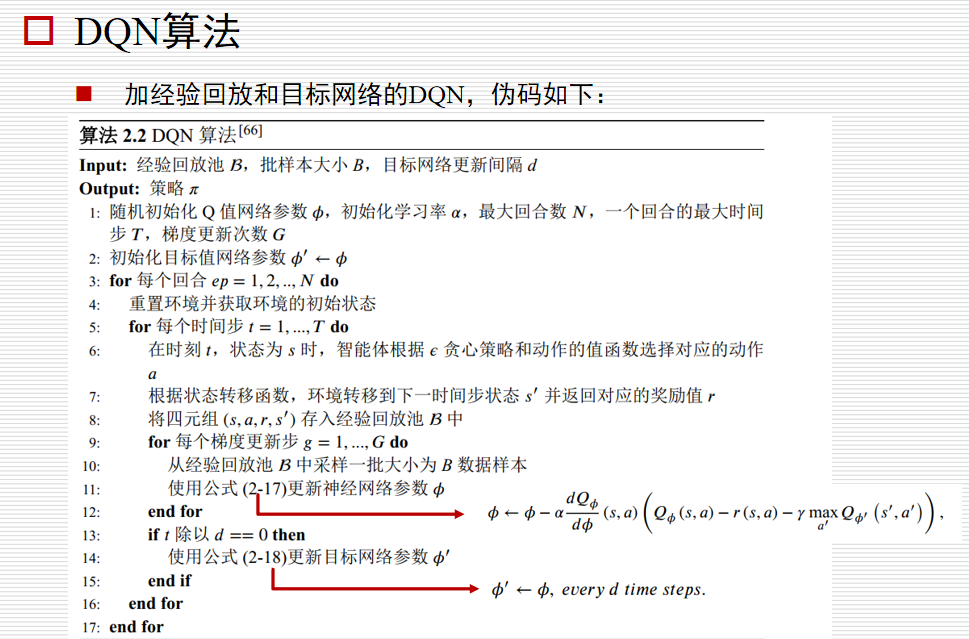
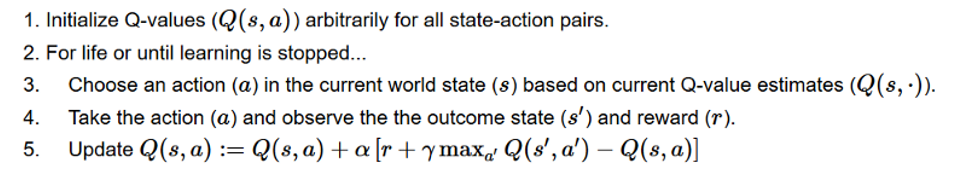
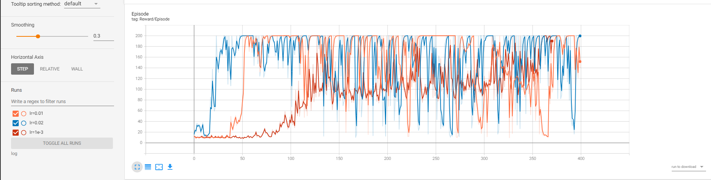
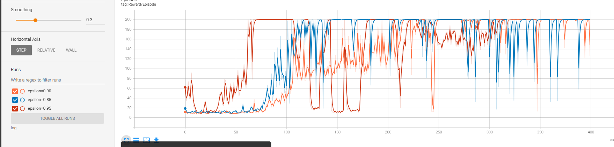
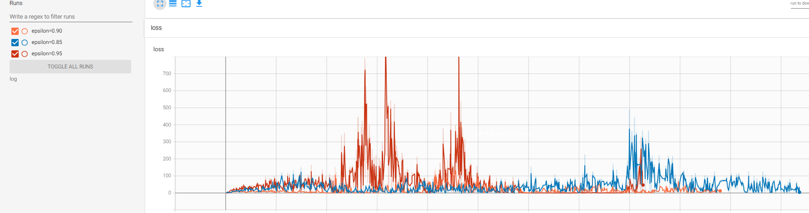
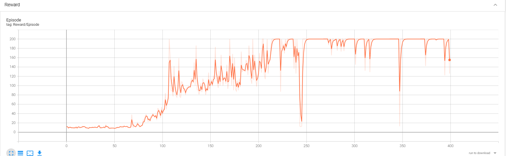
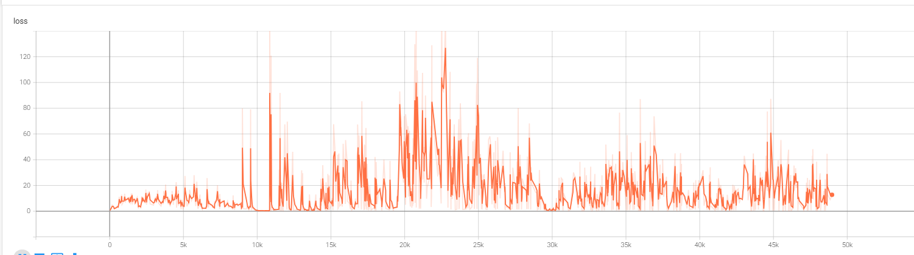

# **中山大学计算机学院人工智能本科生实验报告**

课程名称：Artificial Intelligence

学号： 22336084     姓名：胡舸耀

## 一、实验题目

实现DQN算法

## 二、实验内容

### 1.算法原理



**DQN算法伪代码**

#### （1）神经网络

DQN算法的核心思路是用神经网络拟合最优Q值函数，并根据最优Q值选取动作。
在本次实验中，我们采用MSE作为loss函数。由于环境比较简单，神经网络只有4个输入和2个输出。

#### （2）经验回放

将智能体探索环境得到的数据储存起来，然后随机采样小批次样本更新深度神经网络的参数。

#### （3）Q-Learning算法



是一种 value-based 的强化学习算法，Q即为Q(s,a)，在某一时刻的state状态下，采取动作action能够获得收益的期望。

主要思想是将state和action构建一张Q-table表存储Q值，然后根据Q值选取能够获得最大收益的动作。

基于off-policy时序差分法，且使用贝尔曼方程可以对马尔科夫过程求解最优策略。

### 2.关键代码展示

```python
class QNetwork(nn.Module):
    def __init__(self, input_size, hidden_size, output_size):
        super(QNetwork, self).__init__()
        self.fc1 = nn.Linear(input_size, hidden_size)
        self.fc2 = nn.Linear(hidden_size, output_size)

    def forward(self, inputs):
        x = F.relu(self.fc1(inputs))  # 使用ReLU激活函数作用在第一个全连接层的输出上
        x = self.fc2(x)  # 第二个全连接层，输出即为最终的Q值
        return x
```

```python
class ReplayBuffer:
    def __init__(self, buffer_size):
        self.buffer_size = buffer_size
        self.buffer = deque(maxlen=buffer_size)

    def __len__(self):
        return len(self.buffer)

    def push(self, *transition):
        """添加经验，以五元元组方式存储，假如样本池已满则清除一个样本。"""
        self.buffer.append(transition)
        if len(self.buffer)==self.buffer_size:
            self.clean()

    def sample(self, batch_size):
        batch = random.sample(self.buffer, batch_size)
        return batch

    def clean(self):  
        self.buffer.clear()
```

```python
class AgentDQN(Agent):
    def __init__(self, env, args):
        """
        Initialize every things you need here.
        For example: building your model
        """
        super(AgentDQN, self).__init__(env)
        self.args=args
        self.q_network=QNetwork(4,args.hidden_size,2)
        self.target_network=QNetwork(4,args.hidden_size,2)# 经验池

        self.buffer=ReplayBuffer(args.buffer_size)
        # 用于tensorboard画图
        self.writer=SummaryWriter("log")
        # 计数
        self.counter=0

        # 设置随机数种子
        np.random.seed(self.args.seed)

         # 优化器
        self.optimizer = optim.Adam(self.q_network.parameters(), lr=args.lr)
  
        # 损失函数
        self.loss_fn=nn.MSELoss()
  
    def init_game_setting(self):
        """
        Testing function will call this function at the begining of new game
        Put anything you want to initialize if necessary
        """
        pass

    def train(self):

        transitions = self.buffer.sample(self.args.batch_size)
        batch = list(zip(*transitions))
        state_batch = torch.tensor(batch[0], dtype=torch.float32)
        action_batch = torch.tensor(batch[1], dtype=torch.int64).unsqueeze(1)
        reward_batch = torch.tensor(batch[2], dtype=torch.float32).unsqueeze(1)
        next_state_batch = torch.tensor(batch[3], dtype=torch.float32)
        done_batch = torch.tensor(batch[4], dtype=torch.float32)
  
  
  
        current_q_values = self.q_network(state_batch).gather(1, action_batch)
        # 获得下一状态的最大q值不需要计算目标网络的梯度
        next_q_values = self.target_network(next_state_batch).max(1)[0].detach()
        target_q_values = reward_batch + (1 - done_batch) * self.gamma * next_q_values.unsqueeze(1)

        loss = nn.MSELoss()(current_q_values, target_q_values)

        self.optimizer.zero_grad()
        loss.backward()
        self.optimizer.step()

        self.counter += 1
        if self.counter % self.args.target_update == 0:
            self.target_network.load_state_dict(self.q_network.state_dict())


    def make_action(self, observation, test=True):
        ob = torch.tensor(observation, dtype=torch.float32)
        with torch.no_grad():
            # 估计q值
            qa=self.q_network(ob)
            # q值最大的动作
            greedy_action=qa.argmax().item()
        # ε-greedy策略
        if np.random.random()<self.args.epsilon:
            # 以ε的概率采取最优策略
            return greedy_action
        else:
            # 不然选取非最优策略
            return 1-greedy_actio
  
    def run(self):
        self.target_network.load_state_dict(self.q_network.state_dict())
        t = 0
        for episode in range(self.args.episodes):
            self.init_game_setting()
            state = self.env.reset()
            episode_reward = 0

            while True:
                action = self.make_action(observation=state, test=False)
                next_state, reward, done, _ = self.env.step(action)
                self.buffer.push(state, action, reward, next_state, done)
                state = next_state
                episode_reward += reward
                t+=1

                if t >= self.args.batch_size+1:
                    self.train()
                    t-=1

                if done:
                    break

            print(f"Episode {episode}: Reward = {episode_reward}")
  
            # 将每个episode的奖励写入Tensorboard
            self.writer.add_scalar('Reward/Episode', episode_reward, episode)

        # 关闭TensorboardX SummaryWriter
        self.writer.close()
```

## 三、实验结果

### 1.超参设置

|    参数名    |          作用          |   参数值   |
| :-----------: | :--------------------: | :---------: |
|   env_name   |  代码运行所处环境名称  | CartPole-v0 |
|     seed     |        随机种子        |    11037    |
|  hidden_size  |  神经网络隐藏层节点数  |     64     |
|      lr      |         学习率         |    1e-3    |
|     gamma     |       回报折扣率       |    0.99    |
|   episodes   |        训练次数        |     400     |
|    epsilon    |    选取最优策略概率    |    0.90    |
|  buffer_size  |       经验池大小       |    10000    |
|  batch_size  |     每次选取样本数     |     256     |
| target_update | 神经网络更新所需要步数 |     10     |

### 2.超参分析

对学习率lr和最优策略概率epsilon进行分析

#### （1）lr



当lr为0.02时，reward上下波动最大，0.01时则次之，当为1e-3时，平稳上升最后收敛。选择lr=1e-3

#### （2）epsilon





通过reward曲线，可以看到，当epsilon为0.85时，探索性过强，导致400次循环后收敛度有限；
而当epsilon为0.95时，初期探索度不高，reward值变动大，无法收敛；
当epsilon为0.90时，在250次循环后便展现较好的收敛效果，做最优秀参数。

观察loss曲线同样可以看到，0.95时loss波动过大，0.85时无法完全收敛，loss曲线仍在波动，0.90时loss先增大，后逐渐趋向于0，有着较好效果。

### 3.结果

最后结果如下：





## 四、参考资料

[tensorboard显示多个event文件在一个图
](https://blog.csdn.net/qq_40214464/article/details/116465675)

[强化学习 7—— 一文读懂 Deep Q-Learning（DQN）算法](https://blog.csdn.net/november_chopin/article/details/107912720)
